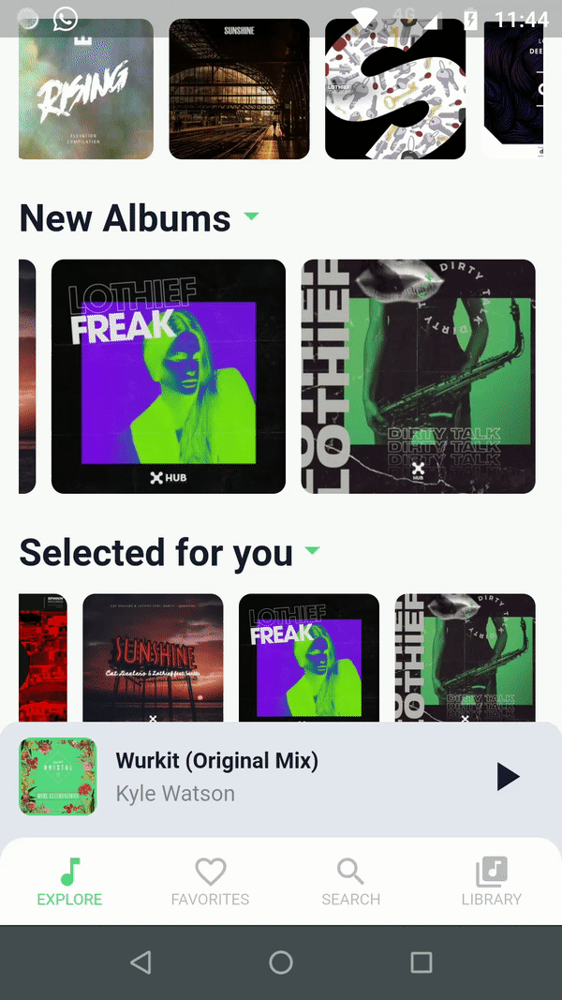

<!-- PROJECT LOGO -->
 

  

  <h3 align="center">WeNotify</h3>
    
    
    

A backdrop animated widget =]  
A backdrop appears behind all other surfaces in an app, 
 
displaying contextual and actionable content.

  

