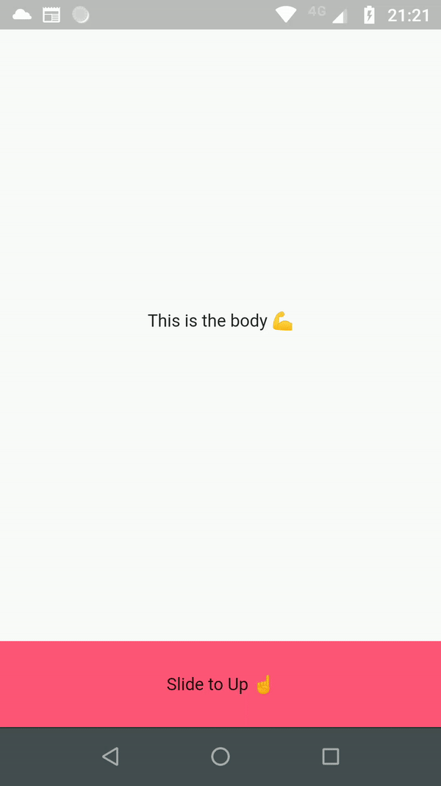

<p align="center">
    
</p>

[](https://pub.dartlang.org/packages/we_slide)
[](https://github.com/luciano-work/we_slide)
[](https://img.shields.io/badge/platform-Android%20%7C%20iOS-green.svg)

The inspiration behind the package was actually a need for a slide transition like spotify (iOS)
Unfortunately, I couldn’t find any efficient package, so I literally banged my fist on the table, 
rolled up my sleeves and created my own solution. Through this package I could better understand 
some principles of flutter animation :)

<p>
  
</p>

## Installation

Add this to your package's pubspec.yaml file:

```yaml
dependencies:
  we_slide: ^0.1.0
```

## Basic Example

```dart
import 'package:we_slide/we_slide.dart';

final _colorScheme = Theme.of(context).colorScheme;
final double _panelMinSize = 70.0;
final double _panelMaxSize = MediaQuery.of(context).size.height / 2;
return Scaffold(
  backgroundColor: Colors.black,
  body: WeSlide(
    panelMinSize: _panelMinSize,
    panelMaxSize: _panelMaxSize,
    body: Container(
      color: _colorScheme.background,
      child: Center(child: Text("This is the body 💪")),
    ),
    panel: Container(
      color: _colorScheme.primary,
      child: Center(child: Text("This is the panel 😊")),
    ),
    panelHeader: Container(
      height: _panelMinSize,
      color: _colorScheme.secondary,
      child: Center(child: Text("Slide to Up ☝️")),
    ),
  ),
);

```

## Custom properties
There are many options that you can change:

|  Properties  |   Type   |   Description   |
|--------------|----------|-----------------|
|   `footer`   |  Widget  | This is the widget that will be below as a footer, this can be used as a `BottomNavigationBar` |

<p>
  
</p>


